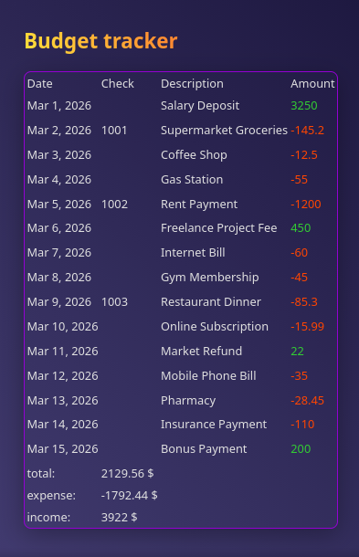

> you should localhost it by yourself
> so project kinda useless yet

it should be smth like
h ttp://localhost/BudgetTracker/public/

in thansaction files you'll find csv tables

**have a nice day**

# csv-transaction-viewer
